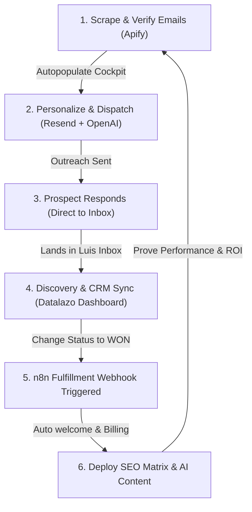

# 📘 Datalazo Intelligence Dashboard: Training Manual

Welcome to the future of business intelligence. This manual explains how to operate the **Datalazo Dashboard** to manage leads, document meetings, and deploy the **AI SEO Matrix** growth engine.

---

## 1. 📂 Intelligence Dashboard (Main)
The main dashboard is your mission control. It provides a real-time overview of your agency's performance.

### 📅 Managing Bookings
*   **Status Workflow**: Track leads through the funnel: `IN_REVIEW` → `CONTACTED` → `WON`/`LOST`.
*   **Meeting Notes**: Click the **"Add Notes"** button on any lead to open the meeting modal. Use this to document qualitative details from discovery calls. These notes are saved permanently.
*   **Cleaning Data**: Use the **"Delete"** button to remove junk leads or test data.

---

## 2. 🚀 AI SEO Matrix (Module 04)
The SEO Matrix is a self-operating growth system. It is divided into two parts: **Intelligence** and **Production**.

### 🔍 Keyword Intelligence
1.  Navigate to the **"SEO Matrix Manager"**.
2.  **Add Target Keywords**: Enter terms your customers are searching for (e.g., *"AI Automation Miami"*).
3.  **Automatic Analysis**: The system immediately analyzes search volume and competition difficulty. Focus on keywords with **High Volume** and **Low Difficulty**.

### ✍️ AI Content Generation
1.  **Generate**: Once a keyword is added, click **"Generate AI Content"**.
2.  **Review**: Once the status changes to `PUBLISHED`, click **"View"**.
3.  **Publish**: Click the cyan **"Publish to Blog"** button to go live.
4.  **Maintenance**: Click **"Unpublish"** to hide an article from the blog without deleting it. Click the **Trash Icon** to remove a keyword entirely.

---

## 3. 💸 Sales & Automation (Module 03)
Your dashboard is connected to **n8n** for advanced fulfillment.

### 🏆 Marking a Deal as WON
1.  In the **Lead Pipeline**, change a lead status to **"Won"**.
2.  **Automation Trigger**: This instantly signals n8n to start the onboarding process (Welcome Email, Invoicing, etc.).

---

## 4. 🧠 Knowledge Base
The Knowledge Base is the "Brain" of your AI.
*   **Uploading**: Upload PDFs, TXT, or DOCX files about your agency services, pricing, or case studies.
*   **Context**: The **AI Customer Service** and the **SEO Matrix** use these files to ensure every answer and article is 100% accurate and aligned with your brand.

---

## 5. ✉️ B2B Lead Generator & AI Outreach Desk (Module 05)
The **B2B Marketing Hub** is a fully automated B2B lead generation and personalized AI cold outreach engine. It connects directly with Apify to scrape local business prospects and uses OpenAI to compose tailored, high-converting sales pitches.

### 🔌 Automated "Set & Forget" Pipeline
Datalazo utilizes an HTTP webhook integration to ingest leads automatically.
1.  **The Webhook (HTTP Request)**: Configured in your Apify console at `https://datalazo.net/api/marketing/apify/webhook` on event `RUN.SUCCEEDED`.
2.  **Lifecycle Filtering**: The system is highly defensive. It filters out started/running events and pings, only executing the lead import upon successful run completion, returning a clean `200 OK` status indicator across all stages.
3.  **Continuous Scheduling**: Under the **Schedules** tab in your Apify Console, configure the Google Maps Scraper Actor (`2Mdma1N6Fd0y3QEjR`) to run periodically (e.g., daily/weekly) with target queries. Every time the schedule runs, fresh validated leads automatically flow straight into your Datalazo table!

### 🔍 Launching Scrapes & Manual Imports
*   **Cockpit Search**: Enter target search queries (e.g., `plumbers in Miami FL`) and limits, then click **"Trigger Scraper Run"** to launch the scraper directly.
*   **Email Extraction**: Datalazo automatically instructs Apify to crawl the visited business websites to extract and verify public email addresses (`scrapeContacts: true`).
*   **Manual Import**: Already finished a run? Copy the Apify **Dataset ID** (e.g., `TZdPHAvB0WPucaMui`), paste it into the box, and click **"Import Scraped Leads"**.

### ✍️ AI Composer & Outreach Dispatcher
Click on any imported lead to open the slide-in **Outreach Composer**:
1.  **Dossier Review**: Inspect the company name, category, website, phone, and location.
2.  **Campaign Selection**: Select from three pre-engineered, high-converting outreach angles:
    *   *Free AI Workflow Audit Offer* (Highly recommended to start the relationship!)
    *   *Direct Agency Services* (AI Voice Receptionists & SEO)
    *   *Partnership Inquiry / Local Client Stream*
3.  **Generate Pitch**: Click **"Generate AI Pitch"** to instruct OpenAI to compose a custom-tailored outreach email referencing their specific business.
4.  **Send via Resend**: Click **"Send Outreach via Resend"** to instantly dispatch the email using your integrated Resend account. Once successfully dispatched, the lead's status changes to `SENT` in real-time!

---

### 🔄 Closing the Loop: The AI Agency Flywheel
When a prospect replies to your AI pitch, they enter your core high-value conversion and fulfillment loop:

1.  **Direct Inbox Responses**: Because Datalazo dispatches pitches using your domain through Resend, replies land directly in your standard agency business inbox.
2.  **Discovery Booking & CRM**: Once a meeting is scheduled, add the prospect to your main **Datalazo CRM Pipeline** (`/dashboard`), moving them to `CONTACTED`. Click **"Add Notes"** to record discovery items.
3.  **The "WON" Deal Trigger**: Once they sign on, change their pipeline status to **`WON`**. This instantly triggers your backend webhook to n8n to execute onboarding (Welcome Packets, Invoicing, etc.) automatically!
4.  **SEO Matrix Delivery**: Launch their client keywords inside the **SEO Matrix Manager**, generate AI content, publish, and use the **Growth Intelligence ROI** panel to demonstrate footprint expansion.

---

## 6. 🛡️ Technical Audit Shield (The Radar)
The Audit Shield allows you to verify the health of any client domain in real-time.

*   **Scan Now**: Enter a URL and click the scan button. The system performs a multi-point check:
    *   **Health Score**: The overall technical integrity (Target: 90+).
    *   **Load Speed**: Real-time response time monitoring (Target: < 2s).
    *   **Broken Links**: Checks for structural errors that kill SEO rankings.
*   **Best Practice**: Run a scan *before* a sales call to show the client their current errors, and *after* onboarding to show them how you've fixed them.

---

## 7. 📈 Growth Intelligence (ROI Proof)
Located at the bottom of the SEO Matrix Manager, this section proves your value.

*   **Keywords Gained**: Tracks the expansion of the client's search footprint.
*   **Content Pieces**: A running tally of live AI-optimized assets.
*   **Export PDF**: Click this to generate a summary for the client. 
*   **Growth Bar**: When the bar hits **"100% Optimized"**, it means the client's "Keyword Matrix" for that month is complete.

---

## 8. 🛡️ Anti-Spam Human Shield (Cloudflare)
To stop bots from spamming your lead capture forms, we use **Cloudflare Turnstile**. This is an invisible protector that ensures every lead is 100% human.

### 🔑 Setting up your Keys
1.  **Sign Up**: Go to [Cloudflare](https://dash.cloudflare.com/sign-up) and create an account.
2.  **Navigate**: In the sidebar, click on **Turnstile**.
3.  **Add Site**: 
    *   **Site Name**: `Datalazo Lead Shield`
    *   **Domain**: `datalazo.net`
    *   **Widget Type**: Select **Managed** (best for security).
4.  **Keys**: Copy your **Site Key** and **Secret Key**.
5.  **Integration**: Provide these keys to the AI Assistant to activate the shield sitewide.

---

## 🚀 Future Scaling & Bookmarks

For when you are ready to upgrade your v3.6 Matrix to "Full Pro" status.

### 🔗 Recommended APIs
*   **[DataForSEO](https://dataforseo.com/)**: The best pay-as-you-go API for live **Search Volume** and **Competition Difficulty**. 
    *   *Usage*: Replace demo numbers with 100% real global search data.
*   **[Serper.dev](https://serper.dev/)**: The fastest and most affordable API for **Current Rank** tracking. 
    *   *Usage*: Track exactly where your clients rank on Google in real-time. (Free for first 2,500 scans).

---
## 🛠️ v4.0 Roadmap & To-Do List
Track the upcoming intelligence upgrades for the Datalazo platform.

*   `[x]` **Anti-Spam Human Shield**: Implement Cloudflare Turnstile + Honeypot to ensure 100% human leads.
*   `[ ]` **Live Keyword Intelligence**: Integrate DataForSEO API for real-time volume/difficulty data.
*   `[ ]` **Real-Time Rank Tracking**: Integrate Serper.dev for live Google position monitoring.
*   `[ ]` **Social Media Content Engine**: Automate article-to-social post generation.

---
*Generated by Datalazo Intelligence Agency | v3.6 — The Growth Matrix Release*
